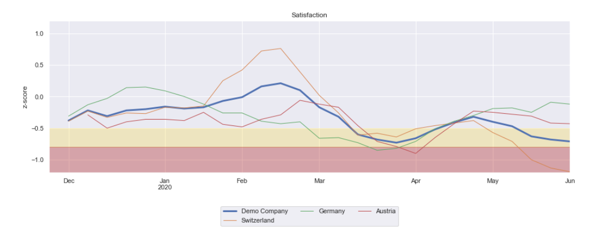
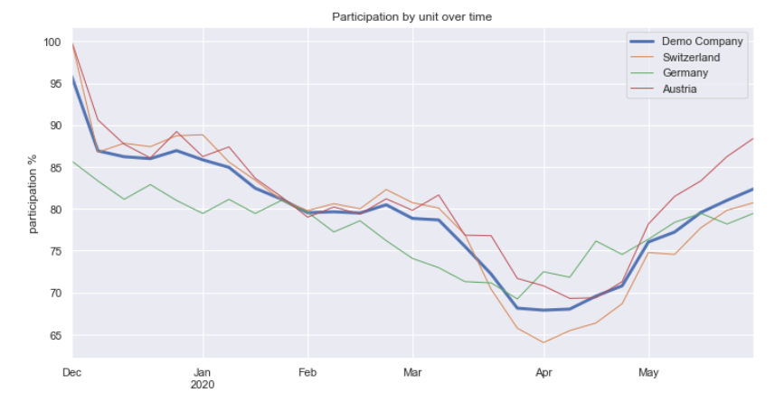
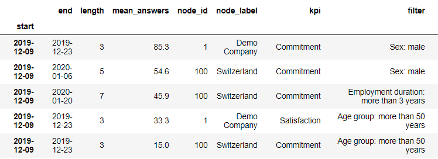

# Ligado time series analysis and visualization of key performance indicators

This repository contains examples of analyses and visualizations of [Ligado](https://ligado.ch/) data. 
Ligado is a web-platform for continuously measuring stress and well-being at the workplace 
based on repeated short employee surveys. Only the Ligado Demo sub-project is included to
demonstrate the approach and algorithms, using synthetic data.

## Domain-specific challenges

- In order to calculate robust KPI timelines based on sparse survey data, a 
[moving average](https://en.wikipedia.org/wiki/Moving_average) algorithm is implemented.

- KPI benchmarks are calculated based on survey data. These benchmarks are used to compare
organization units with each other and to quantify deviations from the KPI mean within the 
organization.
- Deviations from the KPI mean are quantified based on effect sizes and their statistical significance
(one-sample t-test against the benchmark). Medium effects fall within yellow zone and critical effects
fall within the red zone.
- A [nested set model](https://en.wikipedia.org/wiki/Nested_set_model) is used to represent the 
tree structure of the organizational unit hierarchy. This model allows for effizient querying and 
filtering data for specific units and sub-trees.
and parsing.
- Participation statistics are calculated for each organization node.
 
- The KPI data is scanned with several filter combinations to identify time periods with critical
KPI deviations. 
 
 - For more, see the [ligado-demo jupyter notebook](https://github.com/aimfeld/kpi-time-series/blob/master/ligado-demo/ligado-demo.ipynb)
 or the [html version](https://htmlpreview.github.io/?https://github.com/aimfeld/kpi-time-series/blob/master/ligado-demo/ligado-demo.html).

## Technical challenges

- Handle different data sources: remote DB, local DB, or .csv files.
- Setup for [sub-project](https://github.com/aimfeld/kpi-time-series/tree/master/ligado-demo) 
specific jupyter notebooks sharing the [same code base](https://github.com/aimfeld/kpi-time-series/tree/master/ligado).
- Using [.env](https://github.com/aimfeld/kpi-time-series/blob/master/.env.dist) files to extract security-sensitive 
credentials from version control.
- Extracting extendable [configuration](https://github.com/aimfeld/kpi-time-series/blob/master/ligado/config.py) into classes.

## Setup

- Install anaconda: https://www.anaconda.com/distribution/
- Set up the ligado conda environment: `conda env create -f environment.yml`
- The ligado project .ipynb notebooks work both with JupyterLab and PyCharm

## Accessing Ligado data

- Copy .env.dist into the `<project>` folder (e.g. erni-ligado or sbb-ligado) as .env and adjust the settings.
- By default, ligado data is read from a remote production database.
Once the notebook has run, the data read from the DB is stored in `output/import-*.csv` files.
After copying these files into the `<project>/data` folder, you can use these files as data source instead of the DB.
Just override the config in your project notebook with `cfg.data.source = DataSource.CSV`.

