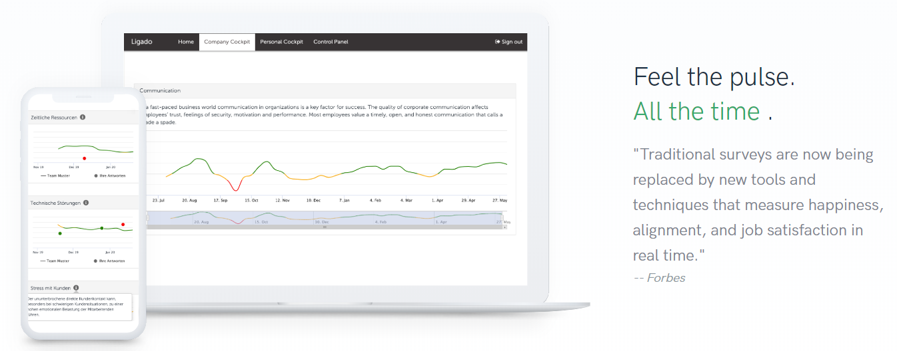

# Ligado time series analysis and visualization of key performance indicators

This repository contains analyses and visualizations of [Ligado](https://ligado.ch/) data. 
Ligado is a web-platform for continuously measuring stress and well-being at the workplace 
based on repeated short employee surveys. Only the Ligado Demo sub-project is included to
demonstrate the approach and algorithms, using synthetic data.

## Domain-specific challenges addressed

- In order to calculate robust KPI timelines based on sparse survey data, a 
[moving average](https://en.wikipedia.org/wiki/Moving_average) is implemented.
- KPI benchmarks are calculated based on survey data. These benchmarks are used to compare
organization units with each other and to quantify deviations from the mean.

- Deviations from the mean are quantified based on effect sizes and their statistical significance
(one-sample t-test)
- [Nested set model](https://en.wikipedia.org/wiki/Nested_set_model) for organigram management
and parsing.

## Technical challenges addressed

- Handle different data sources: remote DB, local DB, or .csv files.
- Setup for sub-project specific jupyter notebooks sharing the same code base (ligado).
- Using .env files to extract security-sensitive credentials.
- Extracting extendable configuration into classes.

## Setup

- Install anaconda: https://www.anaconda.com/distribution/
- Set up the ligado conda environment: `conda env create -f environment.yml`
- The ligado project .ipynb notebooks work both with JupyterLab and PyCharm

## Accessing Ligado data

- Copy .env.dist into the `<project>` folder (e.g. erni-ligado or sbb-ligado) as .env and adjust the settings.
- By default, ligado data is read from a remote production database.
Once the notebook has run, the data read from the DB is stored in `output/import-*.csv` files.
After copying these files into the `<project>/data` folder, you can use these files as data source instead of the DB.
Just override the config in your project notebook with `cfg.data.source = DataSource.CSV`.

